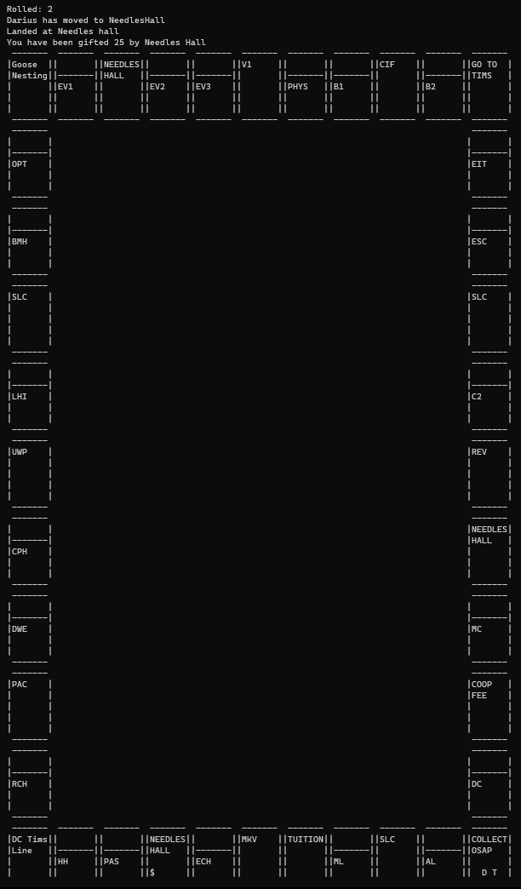

# Watopoly
C++ Custom Monopoly Game - source code available upon request

According to University Policies I am restricted from sharing this projects' source code publicly but I can provide it upon request.

Watopoly is a captivating project developed during the CS246 course at the University of Waterloo, aiming to create a unique variant of the classic board game, Monopoly, with a special University of Waterloo campus theme. The project was implemented in C++, incorporating Object-Oriented Software Development principles for a structured and efficient codebase.

In Watopoly, players take turns moving around a virtual game board with 40 squares, representing the University of Waterloo campus landmarks and buildings. The objective is to be the last player standing in the game by wisely managing finances, owning properties, charging tuition, and avoiding bankruptcy. The game features interactions with academic buildings, gyms, residences, and various non-property squares, each with distinct actions and effects.

To enhance player experience, Watopoly utilized the Observer Pattern for SLC (Student Life Centre) and Needles Hall interactions, which introduced unpredictability and excitement to the game through random player movements. The project also incorporated command-line options to support loading saved games and testing mode with controlled dice rolling.

Watopoly's success lies in its seamless integration of game mechanics, creative theme, and adherence to rigorous Object-Oriented design, offering a dynamic and engaging virtual board game experience for players.

\n
Sample image of the view controller:

#  
